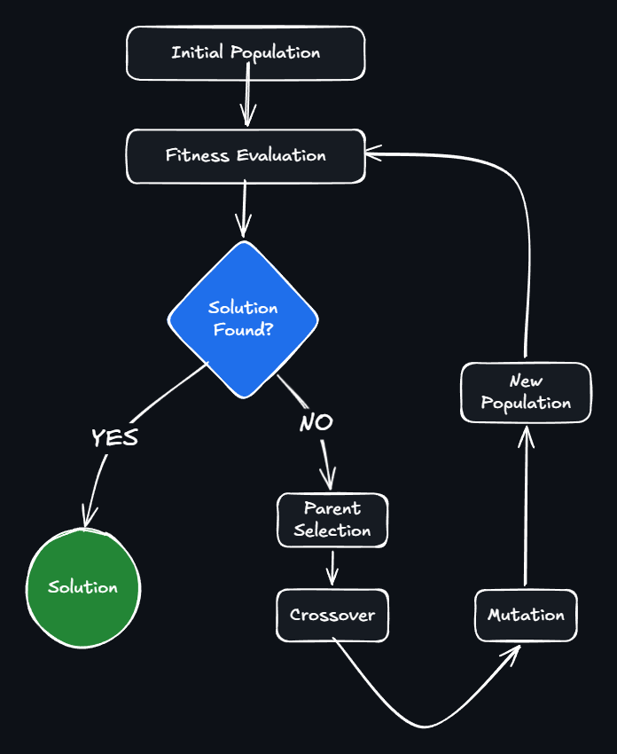
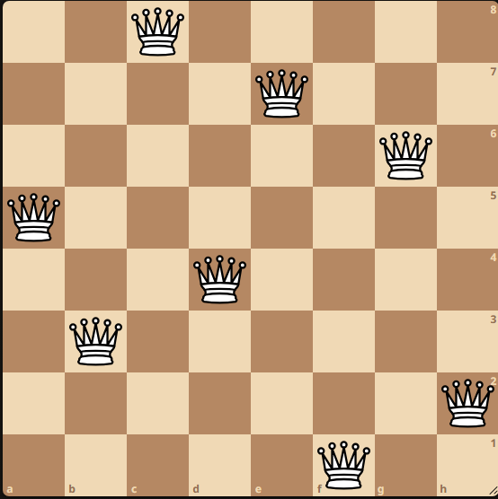
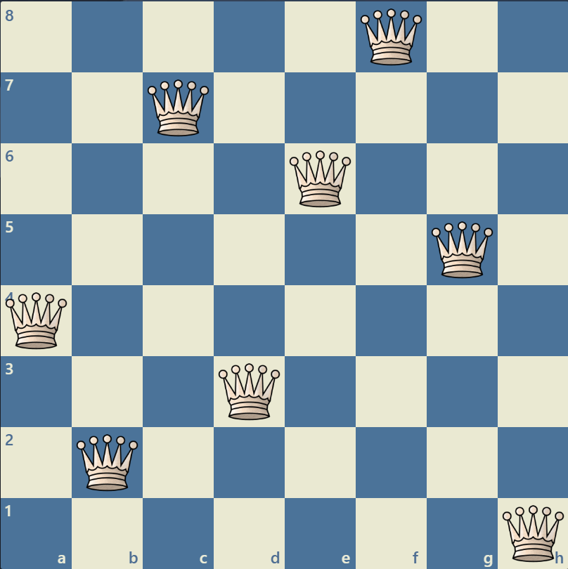
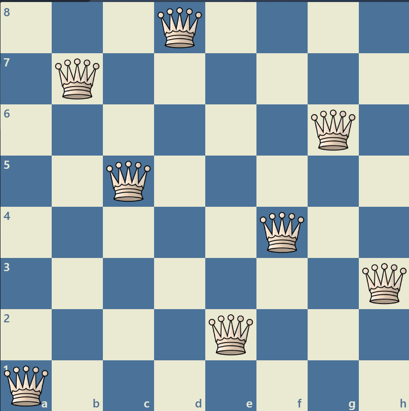
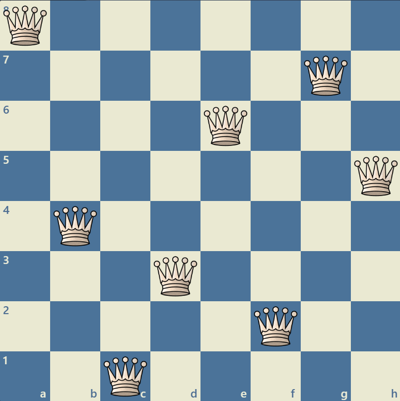
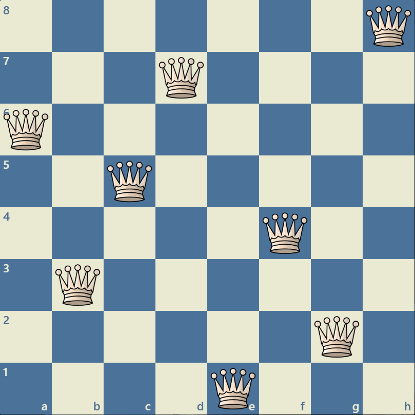
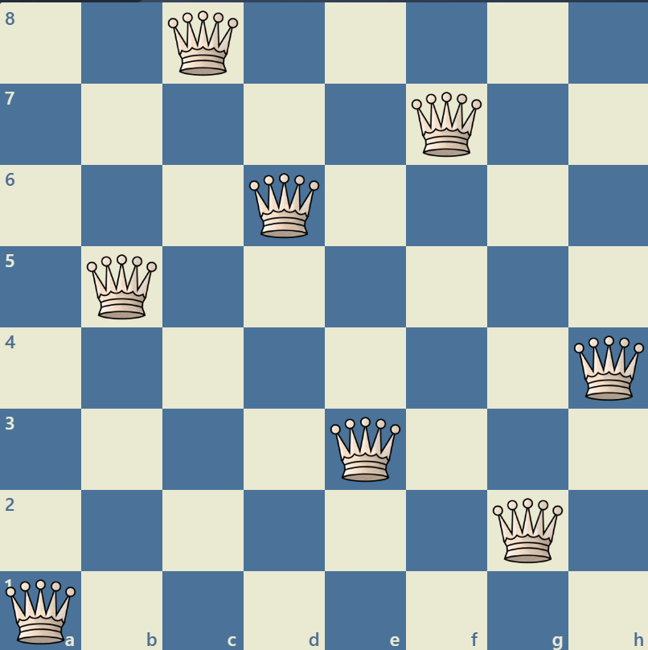
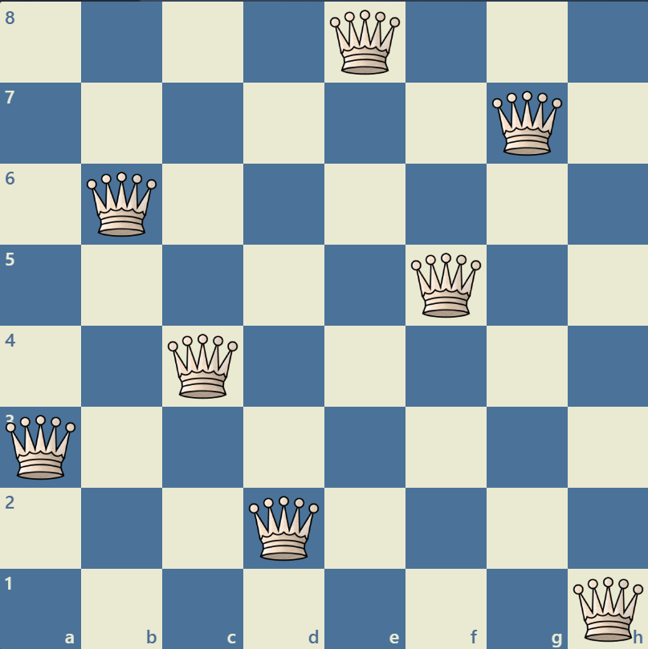
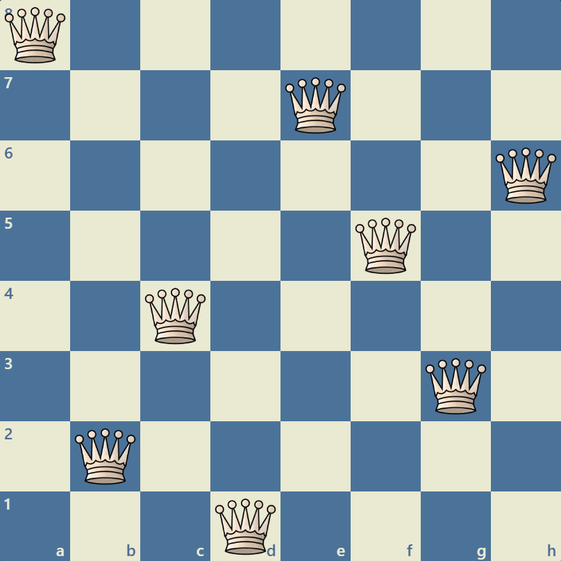

# ♛ N-Queens Problem — Επίλυση με Γενετικό Αλγόριθμο

> Εργασία στο πλαίσιο του μαθήματος Ευφυή Συστήματα και Συστήματα Υποστήριξης Αποφάσεων
> Υλοποίηση σε Python με χρήση PyGAD & Streamlit

## Live Demo

Δοκίμασε την εφαρμογή live χωρίς εγκατάσταση:

**[▶ Open in Streamlit](https://nqueens-ga.streamlit.app/)**

---

## Περιεχόμενα

1. [Περιγραφή Προβλήματος](#1-περιγραφή-προβλήματος)
2. [Γενετικός Αλγόριθμος — Θεωρητικό Υπόβαθρο](#2-γενετικός-αλγόριθμος--θεωρητικό-υπόβαθρο)
3. [Αναπαράσταση Λύσης](#3-αναπαράσταση-λύσης)
4. [Συνάρτηση Καταλληλότητας (Fitness Function)](#4-συνάρτηση-καταλληλότητας-fitness-function)
5. [Τελεστές του Αλγορίθμου](#5-τελεστές-του-αλγορίθμου)
6. [Δομή Κώδικα](#6-δομή-κώδικα)
7. [Διεπαφή Χρήστη (Streamlit)](#7-διεπαφή-χρήστη-streamlit)
8. [Εγκατάσταση & Εκτέλεση](#8-εγκατάσταση--εκτέλεση)
9. [Παράμετροι & Επίδραση στην Απόδοση](#9-παράμετροι--επίδραση-στην-απόδοση)
10. [Αποτελέσματα & Παρατηρήσεις](#10-αποτελέσματα--παρατηρήσεις)

---

## 1. Περιγραφή Προβλήματος

Το **πρόβλημα των N-Queens** ζητά την τοποθέτηση **N βασιλισσών** σε NxN σκακιέρα έτσι ώστε **καμία να μην απειλεί καμία άλλη**. Δύο βασίλισσες συγκρούονται εάν βρίσκονται:

- Στην **ίδια γραμμή** (horizontal conflict)
- Στην **ίδια στήλη** (vertical conflict)
- Στην **ίδια διαγώνιο** (diagonal conflict)

Το πρόβλημα γίνεται υπολογιστικά δύσκολο για εξαντλητική αναζήτηση καθώς το N μεγαλώνει, 
καθώς ο χώρος αναζήτησης αυξάνεται με ρυθμό N!. Για N=20, αυτό αντιστοιχεί σε:
$20! \approx 2.4 \times 20^{18}$
πιθανές διατάξεις, καθιστώντας αναγκαία τη χρήση ευρετικών 
μεθόδων όπως ο Γενετικός Αλγόριθμος.

---

## 2. Γενετικός Αλγόριθμος — Θεωρητικό Υπόβαθρο

Ο **Γενετικός Αλγόριθμος (GA)** είναι μεθευρετική (metaheuristic) τεχνική εμπνευσμένη από τη βιολογική εξέλιξη. Λειτουργεί πάνω σε έναν **πληθυσμό υποψήφιων λύσεων** (χρωμοσώματα) και βελτιώνεται μέσα από γενεές.

### Κύκλος Εξέλιξης


### Βασικές Αρχές

| Έννοια | Βιολογικό Ανάλογο | Στο Πρόβλημα |
|---|---|---|
| Χρωμόσωμα | DNA | Διάταξη βασιλισσών |
| Γονίδιο | Βάση DNA | Γραμμή κάθε βασίλισσας |
| Fitness | Επιβίωση | Αντίστροφο των conflicts |
| Crossover | Αναπαραγωγή | Ανταλλαγή τμημάτων λύσης |
| Mutation | Τυχαία μεταλλαγή | Τυχαία αλλαγή θέσης |

---

## 3. Αναπαράσταση Λύσης

Κάθε λύση αναπαρίσταται ως **λίστα ακεραίων** μήκους N, όπου το **index** αντιστοιχεί 
στη στήλη και το **value** στη γραμμή της βασίλισσας. Αυτή η αναπαράσταση συμπιέζει 
το χρωμόσωμα από έναν N×N δισδιάστατο πίνακα ($N^{2}$ γονίδια) σε μία μονοδιάστατη 
λίστα (N γονίδια), μειώνοντας δραματικά τον χώρο αναζήτησης.

```
Παράδειγμα για N=8:
index (col):  [0, 1, 2, 3, 4, 5, 6, 7]
value (row):  [2, 4, 6, 0, 3, 1, 7, 5]

Αντί για 8×8 = 64 γονίδια → μόνο 8 γονίδια
```


Αυτή η αναπαράσταση **εξαλείφει αυτόματα τις κάθετες συγκρούσεις**, μιας και κάθε στήλη έχει ακριβώς μία βασίλισσα. Ο αλγόριθμος χρησιμοποιεί `allow_duplicate_genes=False` για να αποτρέψει οριζόντιες συγκρούσεις κατά την αρχικοποίηση — ο πληθυσμός ξεκινά ως σύνολο **permutations** του `[0, N-1]`.

---

## 4. Συνάρτηση Καταλληλότητας (Fitness Function)

```python
def fitness_func(ga_instance, solution, _):
    conflicts = 0
    for i in range(n):
        for j in range(i + 1, n):
            # Horizontal Conflict
            if solution[i] == solution[j]:
                conflicts += 1
            # Diagonal Conflict
            if abs(solution[i] - solution[j]) == abs(i - j):
                conflicts += 1
    return -conflicts
```

- **Χρονική πολυπλοκότητα:** $O(N^2)$ ανά χρωμόσωμα
- **Εύρος τιμών:** `[-max_conflicts, 0]`
- **Βέλτιστη τιμή:** `0` (καμία σύγκρουση → λύση βρέθηκε)
- **Τερματισμός:** Ο αλγόριθμος σταματά αμέσως μόλις `fitness >= 0`

Ο αρνητικός ορισμός (αντί penalty) επιτρέπει στο PyGAD να **μεγιστοποιεί** το fitness, κατευθύνοντας φυσικά την αναζήτηση προς μηδενικά conflicts.

---

## 5. Τελεστές του Αλγορίθμου

### 5.1 Επιλογή Γονέων (Parent Selection)

| Τύπος | Περιγραφή |
|---|---|
| `tournament` | Τυχαίες ομάδες, νικά ο καλύτερος — ισορροπία πίεσης |
| `rank` | Επιλογή με βάση κατάταξη, όχι απόλυτο fitness |
| `rws` | Roulette Wheel — πιθανότητα ανάλογη fitness |
| `random` | Τυχαία επιλογή — για σύγκριση baseline |
> Παρατήρηση: Η Τεχνική Roulette Wheel δεν λειτουργεί για αρνητικό `fitness score`
### 5.2 Διασταύρωση (Crossover)

| Τύπος | Περιγραφή |
|---|---|
| `single_point` | Ένα τυχαίο σημείο τομής |
| `two_points` | Δύο σημεία τομής |
| `uniform` | Κάθε γονίδιο επιλέγεται ανεξάρτητα |
| `scattered` | Τυχαία μάσκα bits |

### 5.3 Μετάλλαξη (Mutation)

| Τύπος | Περιγραφή |
|---|---|
| `random` | Αντικατάσταση γονιδίου με τυχαία τιμή |
| `swap` | Εναλλαγή δύο τυχαίων γονιδίων |
| `inversion` | Αναστροφή τμήματος χρωμοσώματος |
| `scramble` | Ανακάτεμα τμήματος χρωμοσώματος |

### 5.4 Ελιτισμός

```python
keep_parents = pop_size // 2
```

Το 50% των καλύτερων ατόμων διατηρείται σε κάθε γενεά, αποτρέποντας την **απώλεια καλών λύσεων**.

---

## 6. Δομή Κώδικα

```
n-queens-ga/
│
├── app.py          # Streamlit UI — visualization & parameter controls
├── ga.py           # Γενετικός αλγόριθμος (PyGAD wrapper)
├── imgs/
│   ├── queen.png       # Εικόνα βασίλισσας (χωρίς σύγκρουση)
│   └── red_queen.png   # Εικόνα βασίλισσας (με σύγκρουση)
└── README.md
```

### `ga.py` — Βασικές Συναρτήσεις

| Συνάρτηση | Περιγραφή |
|---|---|
| `run_ga(...)` | Εκτελεί τον γενετικό αλγόριθμο, επιστρέφει λύση |
| `count_conflicts(board)` | Μετράει τις συγκρούσεις μιας λύσης |
| `board_to_2d(board)` | Μετατρέπει λίστα σε 2D πίνακα |

### `app.py` — Βασικά Στοιχεία

| Στοιχείο | Περιγραφή |
|---|---|
| `render_chessboard(solution, n)` | Παράγει HTML σκακιέρα με inline SVG queens |
| `on_gen(gen, fitness, best_sol)` | Callback ανά γενεά — ενημερώνει UI |
| `UI_THROTTLE = 0.25s` | Rate limiting για το Streamlit refresh |
| `shared{}` | Κοινό state μεταξύ callback και main loop |

---

## 7. Διεπαφή Χρήστη (Streamlit)

Η εφαρμογή οπτικοποιεί σε **πραγματικό χρόνο** την εξέλιξη του αλγορίθμου:

- **Live metrics:** Generation, Best Fitness, Conflicts, Elapsed time
- **Live board:** Η σκακιέρα ενημερώνεται κάθε 250ms με το best solution
- **Conflict highlighting:** Βασίλισσες σε conflict εμφανίζονται με **κόκκινο** χρώμα
- **Adaptive board size:** `cell = min(60, 600 // n)` — N=8 → 60px/cell, N=20 → 30px/cell
- **Final state:** Πράσινο border αν λύθηκε, κόκκινο αν όχι

---

## 8. Εγκατάσταση & Εκτέλεση

### Απαιτήσεις

```bash
python -m venv .venv
```

```bash
# Windows
.venv\Scripts\activate

# macOS/Linux
source .venv/bin/activate
```

```bash
pip install -r requirements.txt
```

### Εκτέλεση

```bash
streamlit run app.py
```

Η εφαρμογή ανοίγει αυτόματα στο `http://localhost:8501`.

---

## 9. Παράμετροι & Επίδραση στην Απόδοση

| Παράμετρος | Προτεινόμενη Τιμή | Επίδραση |
|---|---|---|
| `pop_size` | 100–200 | Μεγαλύτερος → πιο αργός ανά γενεά, καλύτερη κάλυψη χώρου |
| `mutation_probability` | 0.05–0.15 | Πολύ χαμηλή → stagnation, πολύ υψηλή → random search |
| `parent_selection` | `tournament` | Καλύτερη ισορροπία exploration/exploitation |
| `crossover_type` | `single_point` | Γρήγορος και αποτελεσματικός για permutations |
| `mutation_type` | `swap` | Καλή αρχική επιλογή — απλός και αποτελεσματικός |

> **Σημείωση:** Τα `swap`, `inversion` και `scramble` mutation διατηρούν το permutation 
> property καθώς απλώς αναδιατάσσουν υπάρχουσες τιμές, αποτρέποντας duplicates στο 
> χρωμόσωμα. Το `random` mutation δεν έχει αυτή την εγγύηση — το PyGAD το διαχειρίζεται 
> μέσω του `allow_duplicate_genes=False`, αλλά αυτό προσθέτει overhead στον αλγόριθμο.

---

## 10. Αποτελέσματα & Παρατηρήσεις

- Για **N ≤ 12**, ο αλγόριθμος βρίσκει λύση σχεδόν πάντα εντός λίγων δευτερολέπτων με default παραμέτρους.
- Για **N = 20**, απαιτείται μεγαλύτερος πληθυσμός (200+) και υψηλότερο mutation rate.
- Ο συνδυασμός `tournament selection + swap mutation` έδειξε **ταχύτερη σύγκλιση** στις δοκιμές.
- Το πρόβλημα επιδέχεται **πολλαπλές βέλτιστες λύσεις** — για N=8 υπάρχουν 92 διαφορετικές.

### Αριθμός Λύσεων ανά N (OEIS A000170)
| Board size | Total Solutions              | Time to find all solutions (ms) |
| ---------- | ---------------------- | ------------------------------- |
| 1          | 1                      | 1                               |
| 2          | 0                      | 0                               |
| 3          | 0                      | 0                               |
| 4          | 1                      | 2                               |
| 5          | 2                      | 10                              |
| 6          | 1                      | 4                               |
| 7          | 6                      | 40                              |
| 8          | 12                     | 92                              |
| 9          | 46                     | 352                             |
| 10         | 92                     | 724                             |
| 11         | 341                    | 2,680                           |
| 12         | 1,787                  | 14,200                          |
| 13         | 9,233                  | 73,712                          |
| 14         | 45,752                 | 365,596                         |
| 15         | 285,053                | 2,279,184                       |
| 16         | 1,846,955              | 14,772,512                      |
| 17         | 11,977,939             | 95,815,104                      |
| 18         | 83,263,591             | 666,090,624                     |
| 19         | 621,012,754            | 4,968,057,848                   |
| 20         | 4,878,666,808          | 39,029,188,884                  |
| 21         | 39,333,324,973         | 314,666,222,712                 |
| 22         | 336,376,244,042        | 2,691,008,701,644               |
| 23         | 3,029,242,658,210      | 24,233,937,684,440              |
| 24         | 28,439,272,956,934     | 227,514,171,973,736             |
| 25         | 275,986,683,743,434    | 2,207,893,435,808,352           |
| 26         | 2,789,712,466,510,289  | 22,317,699,616,364,044          |
| 27         | 29,363,495,934,315,694 | 234,907,967,154,122,528         |
---
Οι **συνολικές** λύσεις περιλαμβάνουν όλες τις διατάξεις, συμπεριλαμβανομένων των
συμμετρικών παραλλαγών. Οι **μοναδικές** (fundamental) μετρούν κάθε διάταξη μία φορά —
κάθε μοναδική λύση παράγει έως 8 παραλλαγές μέσω 3 περιστροφών (90°, 180°, 270°)
και 4 ανακλάσεων (οριζόντια, κάθετη, κύρια διαγώνιος, δευτερεύουσα διαγώνιος).
Για N=8: 92 συνολικές ÷ 8 παραλλαγές ≈ 12 μοναδικές λύσεις. Αξιοσημείωτο είναι
ότι το N=6 έχει λιγότερες λύσεις από το N=5, αποδεικνύοντας ότι δεν υπάρχει
μονοτονική αύξηση — και κανένας γνωστός τύπος δεν προβλέπει τον ακριβή αριθμό
για γενικό N.

Παράδειγμα συμμετρίας για N=8 — η ίδια μοναδική λύση και οι 7 μετασχηματισμοί της:

<div align="center">
  <table style="table-layout: fixed; width: 100%;">
    <tr>
      <th width="180">Αρχική</th>
      <th width="180">Περιστροφή 90°</th>
      <th width="180">Περιστροφή 180°</th>
      <th width="180">Περιστροφή 270°</th>
    </tr>
    <tr>
      <td></td>
      <td></td>
      <td></td>
      <td></td>
    </tr>
    <tr>
      <th width="180">Ανάκλαση οριζόντια</th>
      <th width="180">Ανάκλαση κάθετη</th>
      <th width="180">Ανάκλαση κύριας διαγ.</th>
      <th width="180">Ανάκλαση δευτ. διαγ.</th>
    </tr>
    <tr>
      <td></td>
      <td></td>
      <td></td>
      <td></td>
    </tr>
  </table>
</div>

## Future Work

- [ ] Zoom / fullscreen mode για τη σκακιέρα
- [ ] Σύγκριση απόδοσης μεταξύ διαφορετικών παραμέτρων
- [ ] Export λύσης σε PNG
- [ ] Animated replay της εξέλιξης ανά γενεά

## Βιβλιογραφία

- Russell, S., & Norvig, P. (2020). *Artificial Intelligence: A Modern Approach* (4th ed.). Pearson.
- Goldberg, D. E. (1989). *Genetic Algorithms in Search, Optimization, and Machine Learning*. Addison-Wesley.
- PyGAD Documentation: https://pygad.readthedocs.io
- Sosič, R., & Gu, J. (1994). Efficient local search with conflict minimization: A case study of the n-queens problem. *IEEE TKDE*.
- *Number of ways of placing n nonattacking queens on an n X n board*: https://oeis.org/A000170